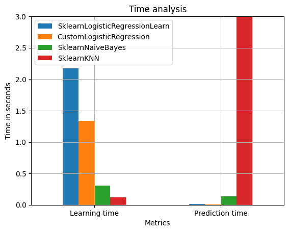
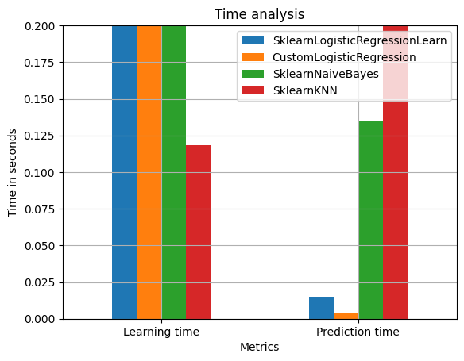
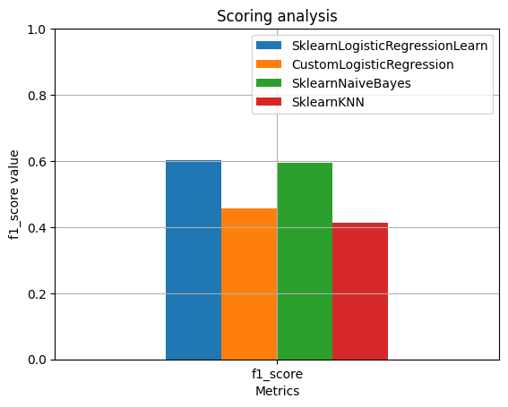

## Classic ML models implementation & research.

## The main goal of the objective was to implement and research (time & scoring features) 3 ML algorithms:
* ### Sklearn LogisticRegression;
* ### Sklearn Naive Bayes Classifier;
* ### Sklearn K-Nearest Neighbors Classifier.

## Also was suggested to customize the LogisticRegression and tune own OOP-based model.

## There also was f1_score & time analysis discussion during the solution:

* ### Time Barplots

* ### f1_score Barplot

## All study notes and code are [right here](weather_prediction_classic_ML.ipynb)!

