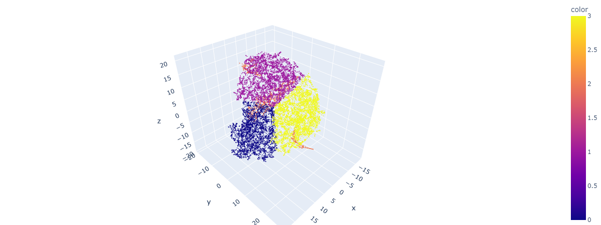

# Unsupervised learning

### All essential info and code you may get in [file](unsupervised_learning_upd_2_1k.ipynb)

### Unfortunately, GitHub and Collab doesnt's show the plotly scatter plots correctly. 
That's why the picture with the best result is: 
Gaussian Mixture for 3 tsn-e components analysis with 4 clusters defined.

